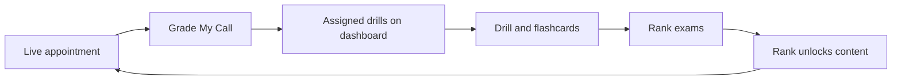
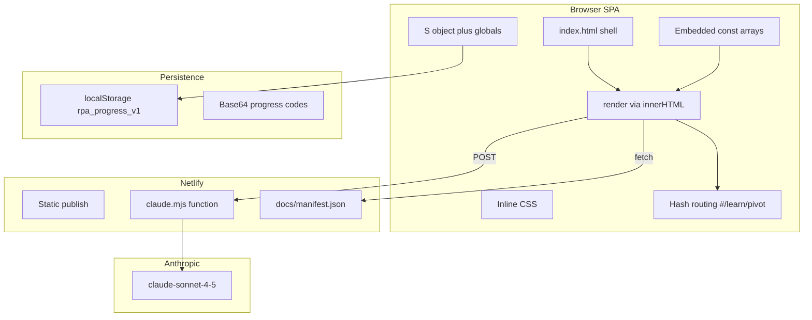

**Converting this app to React is a good move** — the single-file setup is hard to maintain, but you need a careful migration so progress codes, rank gates, and Netlify AI keep working. Below is the full architecture read and a concrete plan for **Vite + React (JS)**, **BrowserRouter**, and **CSS modules** at the repo root.

---

## What this platform is

**Red Panda Closer Academy** is a mobile-first **sales rep training app** for Red Panda Roofing (scripts still say "New Era Roofs" until source docs are updated). It trains closers from **Rookie → Apprentice → Closer → Top Rep** using the company playbook: 12-step process, 20 objection scenarios, 22 KPIs, and a structured Training Protocol.

The closed loop:



---

## Current architecture

Everything is in [`netlify_files/index.html`](netlify_files/index.html) (~1,230 lines, ~311KB — mostly embedded base64 logos).



### Backend

[`netlify_files/netlify/functions/claude.mjs`](netlify_files/netlify/functions/claude.mjs):

- POST-only proxy to Anthropic Messages API
- Needs `ANTHROPIC_API_KEY` in Netlify env vars
- Client: `/.netlify/functions/claude` with `{ prompt }`

### Six bottom tabs

| Tab | Route (today) | Purpose |
|-----|---------------|---------|
| Home | `#home` | Dashboard, rank, assignments, protocol |
| Learn | `#learn/{tab}` | 12 Steps, Glossary, Pivot, KPIs, Discovery, Scripts, Field Kit |
| Drill | `#drill/{tab}` | Flashcards, Partner Drills, Train My Weakness, Protocol |
| Rank Up | `#quiz` | Apprentice / Closer / Top Rep exams (80% to pass) |
| Panda Bot | `#bot` | AI playbook coach |
| Grade Call | `#grade` | AI transcript grader (22 KPIs) |

### Rank gates

| Rank | Unlocks |
|------|---------|
| **Rookie** (0) | 12-Step, Discovery, Flashcards |
| **Apprentice** (1) | Pivot Points, Partner Drills — pass Apprentice Exam |
| **Closer** (2) | Grade My Call — pass Closer Exam |
| **Top Rep** (3) | Full platform — pass Top Rep Exam |

### Progress state (`S` object)

Saved to **`localStorage` key `rpa_progress_v1`** on every change:

- `rank`, `best`, `cards`, `drills`, `assignments[]`
- `lastGrade`, `kpiStats`, `scenStats`, `customDone`
- `proto` (Training Protocol phases)
- `chat[]` (Panda Bot)

Backup/restore uses the same base64 JSON progress codes as today.

### Knowledge base (embedded in HTML)

| Data | Size / role |
|------|-------------|
| `STEPS` | 12-step process + scripts |
| `SCENARIOS` | 20 pivot objection flows |
| `KPIS` | 22 scoring definitions |
| `DISCOVERY`, `GLOSSARY`, `KEYSCRIPTS` | Reference content |
| `CARDS` | 25 flashcards |
| `DRILLS` | 6 partner drills |
| `QUIZZES` | 3 rank exams |
| `PROTOCOL` | Daily 20, 4 training phases |
| `DIAGNOSE` | 8 objection conditions |

### AI features (optional)

1. **Panda Bot** — Q&A from embedded knowledge (`kbPrompt()`)
2. **Grade My Call** — Transcript → JSON scorecard + drill assignments (rank ≥ 2)
3. **Train My Weakness** — Custom quiz / drill / roleplay from weakness data

Everything else works **without AI**: Learn, flashcards, manual drill logging, exams, protocol, progress codes.

### Field Kit

- Fetches [`netlify_files/docs/manifest.json`](netlify_files/docs/manifest.json)
- Links to PDFs under `docs/`
- Repo has manifest only; PDFs are added per [`netlify_files/README.txt`](netlify_files/README.txt)

---

## Is React conversion OK?

**Yes — this app has outgrown one HTML file.**

**Why it helps:**

- 6 views × sub-tabs × session state (quiz, cards, recall timer, roleplay)
- Global `onclick` + full `innerHTML` re-renders are brittle
- ~450 lines of data belong in modules
- Timers need proper React cleanup (`useEffect`)

**Risks and mitigations:**

| Risk | Mitigation |
|------|------------|
| Progress codes break | Keep `rpa_progress_v1` schema and base64 encode/decode identical |
| URLs change `#learn` → `/learn` | Netlify `public/_redirects`: `/* /index.html 200` |
| Visual drift | CSS modules from existing classes; parity pass before cutover |
| Large bundle | Move base64 images to `public/assets/` |
| AI prompt drift | Copy `kbPrompt`, grade, train prompts verbatim to `src/services/aiPrompts.js` |
| PDF paths | Serve from `public/docs/` |

**Avoid in v1:** changing business logic, adding TypeScript/Tailwind, or a backend DB (Phase 2: real accounts + team dashboard per README).

---

## Target structure (root = React app)

```
RedPandaAcademy/
├── README.md
├── package.json
├── vite.config.js
├── index.html                 # Vite entry
├── netlify.toml               # build → dist, functions → netlify/functions
├── public/
│   ├── _redirects             # SPA fallback for BrowserRouter
│   ├── assets/                # logos (from base64)
│   └── docs/                  # manifest + PDFs
├── netlify/
│   └── functions/claude.mjs
├── netlify_files/             # legacy — keep until QA passes
└── src/
    ├── main.jsx
    ├── App.jsx
    ├── routes.jsx
    ├── data/                  # steps, scenarios, kpis, quizzes, etc.
    ├── context/ProgressContext.jsx
    ├── hooks/                 # useFieldKit, useRecallTimer
    ├── services/              # ai.js, aiPrompts.js
    ├── utils/                 # storage.js, escape.js
    ├── components/
    │   ├── layout/            # AppShell, Header, TabNav
    │   ├── ui/                # Card, Button, Accordion, Quiz, Flashcard, Chat
    │   └── learn/             # StepsList, ScenarioList, FieldKitList
    ├── pages/
    │   ├── HomePage.jsx
    │   ├── LearnPage.jsx      # /learn/:tab
    │   ├── DrillPage.jsx      # /drill/:tab
    │   ├── QuizPage.jsx
    │   ├── BotPage.jsx
    │   └── GradePage.jsx
    └── styles/
        ├── global.css
        └── tokens.css
```

---

## Routing (BrowserRouter)

| Path | Page |
|------|------|
| `/` | Home |
| `/learn/:tab?` | Learn (default `steps`) |
| `/drill/:tab?` | Drill (default `cards`) |
| `/quiz` | Rank Up |
| `/bot` | Panda Bot |
| `/grade` | Grade Call |

**Netlify** — `public/_redirects`:

```
/*    /index.html   200
```

Preserve deep links to scenarios via `location.state` or hash on accordion IDs (`acc-p3`, `diagnose`).

---

## State management

- **`ProgressContext` + `useReducer`** for all `S` fields and actions (`RANK_UP`, `SCORE_CARD`, `IMPORT_PROGRESS`, etc.)
- **Page-local state** for active quiz, card run, recall timer, train session
- **Auto-save** via `useEffect` → same `rpa_progress_v1` key

---

## CSS modules

1. `:root` tokens → `src/styles/tokens.css`
2. Global reset → `src/styles/global.css`
3. Per-component `.module.css` reusing current class names (`.card`, `.btn`, `.script`, `.qopt`, etc.)

Goal: **pixel parity**, not a redesign.

---

## Netlify (updated root config)

```toml
[build]
  command = "npm run build"
  publish = "dist"
  functions = "netlify/functions"

[functions]
  node_bundler = "esbuild"
```

Move function to `netlify/functions/`, docs to `public/docs/`, keep `ANTHROPIC_API_KEY` in env vars.

---

## Migration phases

| Phase | Work |
|-------|------|
| **0 — Scaffold** | Vite + React at root, react-router-dom, empty pages, Netlify build |
| **1 — Data** | Extract constants → `src/data/`, port storage/AI utils, move assets + docs |
| **2 — Learn** | Layout, UI components, LearnPage (all tabs), Field Kit |
| **3 — Home** | Dashboard, progress backup/restore, verify old progress codes |
| **4 — Drill** | Flashcards, partner drills, Protocol + recall timer |
| **5 — Quiz** | Exams, 80% pass, assignments, rank up |
| **6 — AI** | Bot, Grade Call, Train My Weakness |
| **7 — Cutover** | QA, deploy, keep `netlify_files/` as archive until verified |

**Rough effort:** ~4–6 focused days for feature parity.

---

## QA before production swap

**No AI:** fresh Rookie flow, flashcards, exams, progress codes, Field Kit, protocol recall, failed-quiz assignments  

**Gates:** Pivot + partner drills locked until Apprentice; Grade until Closer  

**With API key:** Panda Bot, Grade Call, Train generator  

**Deploy:** build succeeds, SPA routes work, function reachable

---

## First coding step (after you approve)

1. Scaffold Vite + React at repo root  
2. Extract `src/data/` from `index.html` (lines ~92–547)  
3. `ProgressContext` + `AppShell` + routes  
4. Ship **HomePage** + **Learn → steps** first  

That proves routing, styling, and progress persistence before the heavier Drill/AI pages.

---

**Your choices locked in:** Vite + JS, BrowserRouter, CSS modules, root-level app with `netlify_files/` kept as reference.

If this plan looks right, say **go ahead** and we can start Phase 0 (scaffold + data extraction). If you want changes (e.g. keep hash routing for bookmark compatibility), say so before we code.