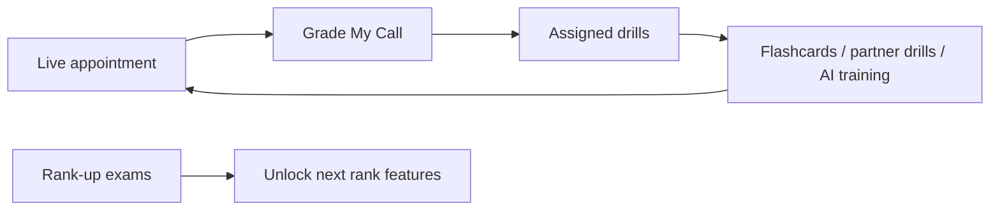
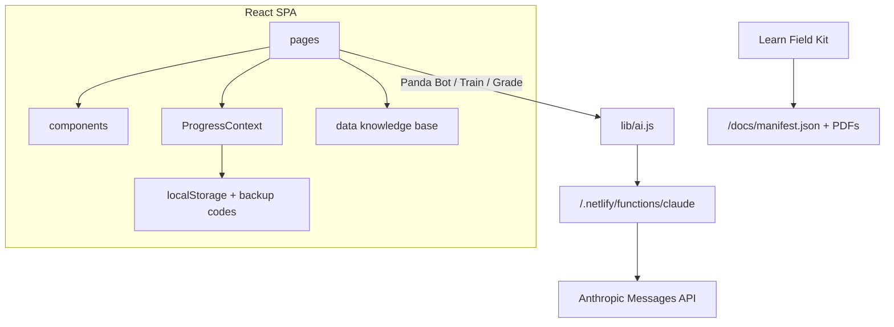

# Red Panda Academy — React Conversion Plan

## What this platform is

Red Panda Closer Academy is a **mobile-first sales training app** for Red Panda Roofing (rebranding from New Era Roofs). Scripts still say “New Era Roofs” on purpose until source docs are updated.

It is not a marketing site. It is a **closed training loop**:



**Ranks (earn the right):** Rookie → Apprentice (80% exam) → Closer (80%) → Top Rep (80%). Features unlock by rank:

- Rookie: 12-Step, Discovery Form, flashcards, glossary, KPIs, Field Kit, Protocol Phase 1
- Apprentice: Pivot Points library + partner drills
- Closer: Grade My Call + advanced AI training
- Top Rep: full platform; scoreboard becomes call grades

There are **no user accounts**. Progress lives on-device (`localStorage` key `rpa_progress_v1`) plus a backup/restore code. Real accounts + team dashboard are explicitly Phase 2 (out of scope).

---

## How it works today

Everything is one file: [`netlify_files/index.html`](netlify_files/index.html) (~1,230 lines of JS + CSS + huge base64 images). It is already a SPA:

- Hash routing (`#learn/pivot`) + bottom tab bar
- String-template `innerHTML` rendering
- Knowledge base baked in as JS constants (the real “docs”)
- AI via [`netlify_files/netlify/functions/claude.mjs`](netlify_files/netlify/functions/claude.mjs) (`ANTHROPIC_API_KEY` on Netlify)
- Field Kit reads [`netlify_files/docs/manifest.json`](netlify_files/docs/manifest.json) and links to PDFs in `/docs/`

**Important docs note:** [`netlify_files/docs/`](netlify_files/docs/) only contains `manifest.json` in this repo. The 8 PDFs it lists are **not present**. The training logic you asked me to read is **inside `index.html`**, ingested from those source documents. Field Kit downloads will stay empty until those PDFs are added.

### Six screens

| Tab | What it does |
|---|---|
| Home | Rank card, assigned drills, flashcard/drill stats, Protocol Daily 20, Train My Weakness, ladder, Field Kit shortcut, backup/restore |
| Learn | 12 Steps, Glossary (search), Pivot Points (locked &lt; Apprentice), 22 KPIs, Discovery Form, Key Scripts, Field Kit |
| Drill | Flashcards (weak-first, nail ×2 = mastered), Partner Drills (locked &lt; Apprentice), Train My Weakness (AI quiz/drill/roleplay), Training Protocol |
| Rank Up | 3 exams, 80% pass, misses become Home assignments |
| Panda Bot | Docs-only coach; every answer must name step + KPI; refuse anything not in the playbook |
| Grade Call | Locked until Closer. Paste transcript (≥200 chars) → 22-KPI JSON scorecard, scenario tags, “where the deal died,” 2 drills assigned |

### Knowledge base (do not rewrite)

Extract these constants as data modules — content stays verbatim:

- `RANKS`, `PHASES`, `STEPS` (12 steps / 4 phases)
- `DISCOVERY`, `SCENARIOS` (20 pivot points), `FOURCS`
- `KPIS` (22), `KEYSCRIPTS`, `CARDS`, `DRILLS`, `DRILL_LINKS`
- `QUIZZES` (3 exams + appended glossary/protocol questions)
- `GLOSSARY` (34 terms), `DIAGNOSE` + diagnose model/tools
- `PROTOCOL` (4 phases, Daily 20, burnout rules)

### Progress snapshot (must stay compatible)

```js
{ rank, best, cards, drills, assignments, kpiStats, scenStats, customDone, proto }
```

`chat` and `lastGrade` are **not** persisted today. Keep that. Backup codes use `btoa(unescape(encodeURIComponent(JSON.stringify(snapshot()))))` — keep the **same encode/decode** so existing reps can restore codes after the React deploy.

---

## Is converting to React a problem?

**No functional blocker.** It is already a client-side SPA. React is a rendering/structure change, not a product rewrite.

Risks to plan around (not reasons to avoid React):

1. **Deploy model changes.** Today: drag the whole `netlify_files` folder. After: Git/Netlify build (`npm run build` → `dist`). The Claude function and `ANTHROPIC_API_KEY` stay. Drag-and-drop of the old folder will no longer be the live site.
2. **Existing hash URLs break.** You chose BrowserRouter (`/learn/pivot`). Bookmarks like `site.com/#learn/pivot` will not map automatically. We add a Netlify SPA fallback (`/* → /index.html 200`). Optional later: a tiny hash-to-path redirect if reps complain.
3. **Progress must not reset.** Same `localStorage` key + same backup-code algorithm. Domain must stay the same Netlify site, or codes are the recovery path.
4. **Field Kit PDFs are missing** from the repo. Manifest will work; downloads 404 until PDFs are dropped into `public/docs/`.
5. **CSS modules = visual QA.** Existing CSS is complete and branded. We keep the same tokens (`--bg`, `--panda`, etc.) and port class-by-class. Expect a visual pass, not a redesign.
6. **Do not “improve” sales logic.** Verbatim scripts, rank gates, 80% line, diagnose-first rules, and AI prompt constraints stay as-is. React is structure only.
7. **AI prompt size.** Every bot/train call ships the full knowledge base. Same as today; still under the function’s 200k prompt cap. Do not “optimize” the prompt in v1.
8. **`window.claude.complete`** is a Claude-artifact leftover. Keep as optional fallback; production path is the Netlify function.
9. **Huge base64 images** in `index.html` should become `public/` files (favicon, panda mark, lockup). Shrinks the bundle and is required for a sane Vite app.

None of these are reasons not to convert. They are reasons to **port, not rewrite**.

---

## Target layout (repo root, not a subfolder)

`netlify_files/` stays untouched as the original artifact archive.

```
RedPandaAcademy/
  README.md
  package.json
  vite.config.js
  netlify.toml
  public/
    _redirects
    favicon.png
    panda.png
    lockup.png
    docs/                  # manifest.json + PDFs when available
  src/
    main.jsx
    App.jsx
    styles/global.css      # :root tokens + reset only
    data/                  # knowledge base modules
    context/ProgressContext.jsx
    lib/storage.js
    lib/ai.js
    lib/progressCode.js
    components/            # Header, TabBar, Card, Accordion, etc.
    pages/
      HomePage.jsx
      LearnPage.jsx        # + Learn sub-sections
      DrillPage.jsx
      QuizPage.jsx
      BotPage.jsx
      GradePage.jsx
  netlify/functions/claude.mjs
  netlify_files/           # original, do not modify
```

Routing (React Router BrowserRouter):

- `/` Home
- `/learn`, `/learn/:tab` (`steps` | `gloss` | `pivot` | `kpis` | `disc` | `scripts` | `kit`)
- `/drill`, `/drill/:tab` (`cards` | `live` | `train` | `proto`)
- `/quiz`
- `/bot`
- `/grade`

---

## Architecture after conversion



**State split:**

- **Persisted (context):** rank, best scores, cards, drills, assignments, kpi/scen stats, customDone, proto
- **Session (page-local):** quiz run, flashcard run, recall timer, train generator session, glossary query, open accordion
- **AI (lib):** `aiComplete(prompt)` — try `window.claude.complete`, else POST the Netlify function

CSS: `src/styles/global.css` for tokens/reset; each component/page gets a `.module.css` that reuses the same class names/values from the current stylesheet.

---

## Implementation sequence (after you approve)

Do this in order so the app is usable after each step.

1. **Scaffold** Vite React JS at repo root. Root [`netlify.toml`](netlify.toml): `command = npm run build`, `publish = dist`, `functions = netlify/functions`. Copy `claude.mjs` to `netlify/functions/`. `public/_redirects`: `/* /index.html 200`.
2. **Extract data + assets.** Move knowledge-base constants into `src/data/`. Decode the two base64 images into `public/`. Copy `docs/manifest.json` to `public/docs/`.
3. **Progress layer.** Port `snapshot` / `autoSave` / `autoLoad` / export-import **byte-compatible**. ProgressContext wraps the app.
4. **Shell.** Header, rank chip, back button, bottom tabs, rank